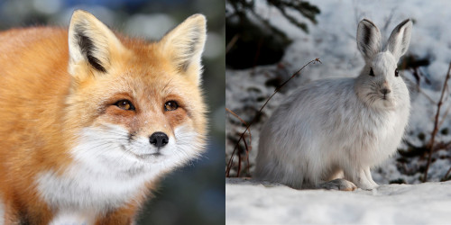

# Predator-Prey Model Lotka-Volterra



## Overview
This Streamlit app simulates the classic Lotka-Volterra Predator-Prey model, allowing users to explore the dynamics between predators and prey over time. The Lotka-Volterra equations describe the interactions between two species in an ecosystem, where one species (prey) is the food source for the other species (predator).

## Install Required Packages
It is recommended you create an optional virtual environment to isolate project dependencies.

Install the necessary Python packages using pip:
```bash
pip install -r requirements.txt
```

## Running the App
You can run the Streamlit app using the following command:
```bash
streamlit run main.py
```
This will launch the app in your default web browser.

